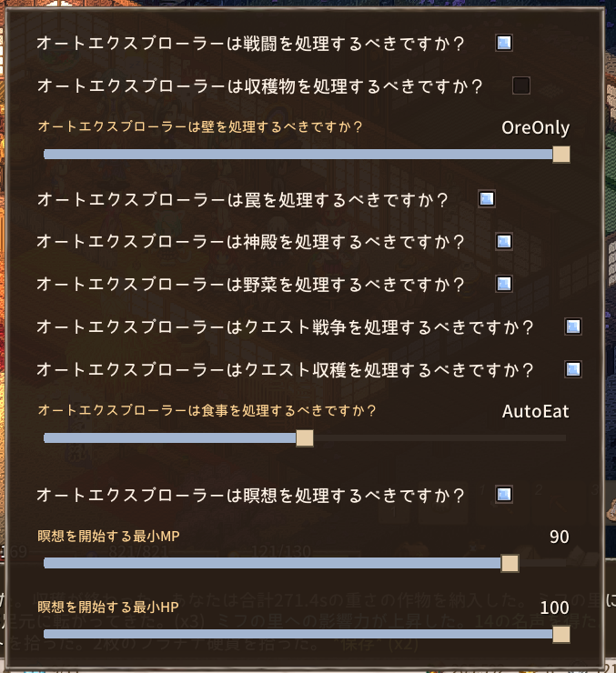

# Readme
* This is an extension of https://steamcommunity.com/sharedfiles/filedetails/?id=3365829584.
* We would like to express our deepest thanks to the author, Mr. Yuof.
* Added the following features to the stock one.
  * Vegetable Harvesting -- This is a mode to harvest only vegetables/grass.
  * Ore collection function -- only ores/precious stones/crystals can be collected.
  * Automated quest “harvesting” function -- This function automates the quest “harvesting” to some extent.
    * The “Harvesting” function automates the “Harvesting” to a certain extent.
    * Calculates a weighted score based on distance and expected weight, and harvests based on that score.
    * Just automatic harvesting, so you have to do your own delivery, remaining time adjustment, etc.
  * Automated quest “war” function -- This function automates the quest “war” to some extent.
    * If there is something that can be picked up (not something that can be harvested), it will be picked up with the highest priority.
    * If there is nothing to pick up, then attack the enemies closest to the player in order, regardless of whether they are in or out of sight.
    * Just keep picking up and hitting them, so you can handle the whistle yourself.

* Added “vegetable mode” and “ore only mode” at the end of the L button press.
* Added an item to the config as well
* The following modes are also available in Home
  * Vegetable harvest mode.

---

# How to use.
* SUBSCRIBE to https://steamcommunity.com/sharedfiles/filedetails/?id=3365829584 in advance.
* Overwrite the Elin_AutoExplore.dll you built or downloaded from here to the folder of the stock mod you subscribed to.
* Depending on your installation folder, the stock mod is usually stored in “C:\Program Files (x86)\Steam\steamapps\workshop\content\2135150\3365829584”, etc.

---

# Recommended settings
This is the best recommendation for me.

# Extended description in source code
* Added Ex_FindVegetables() and Ex_FindOres() to AutoActionFinder.cs
* Added a related entry to Translation.cs to simplify the process.
* Also modified SetNextMode() / SetMode() in AutoExplorerConfig.cs a little.
* Ore/precious stone recovery has been integrated into the existing mining mode.
* Automated “Harvesting” quests are implemented by newly creating Ex_FindQuest_Harvest() in AIActionFinder.cs.
* Quest “War” automation is implemented by adding _IsHandleCombat() in Plugin.cs, and adding a judgment to FindTargetEnemies().
* Some refactors for other extensions